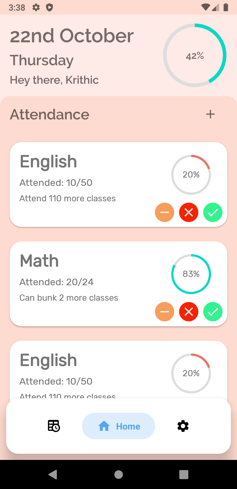
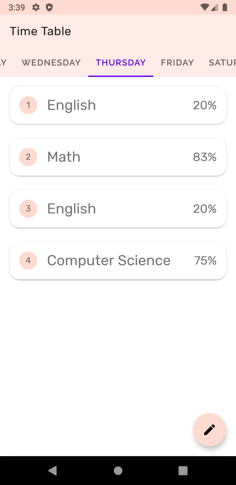
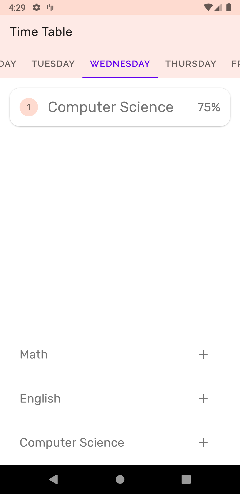
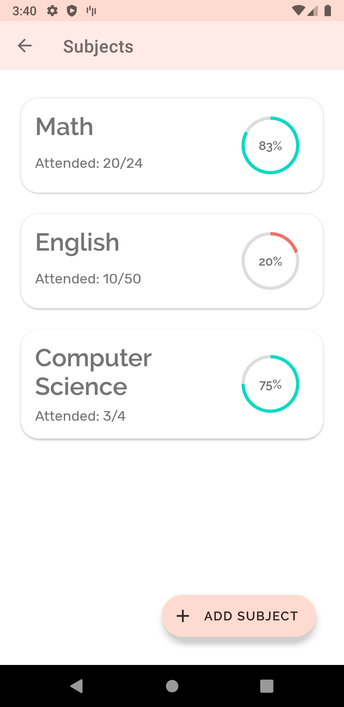
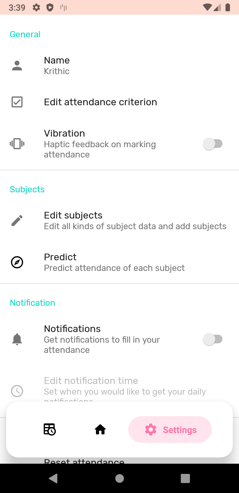
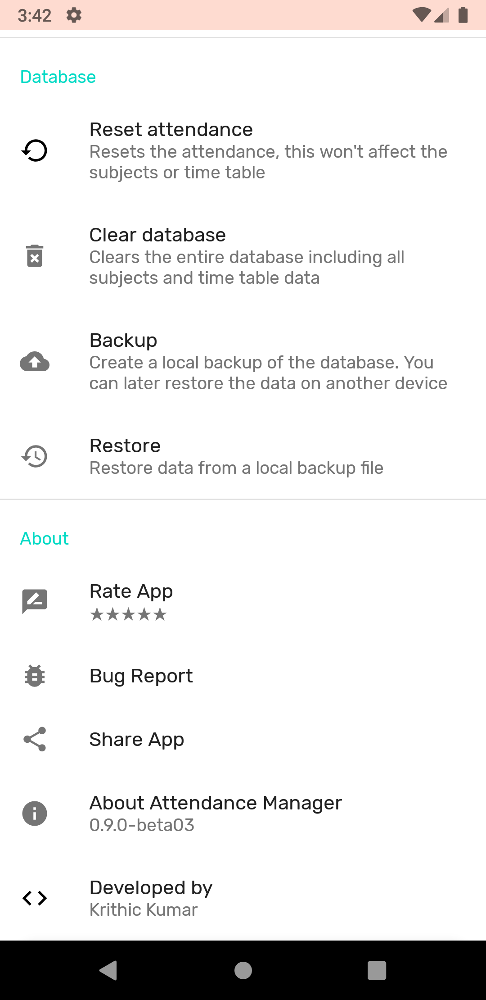
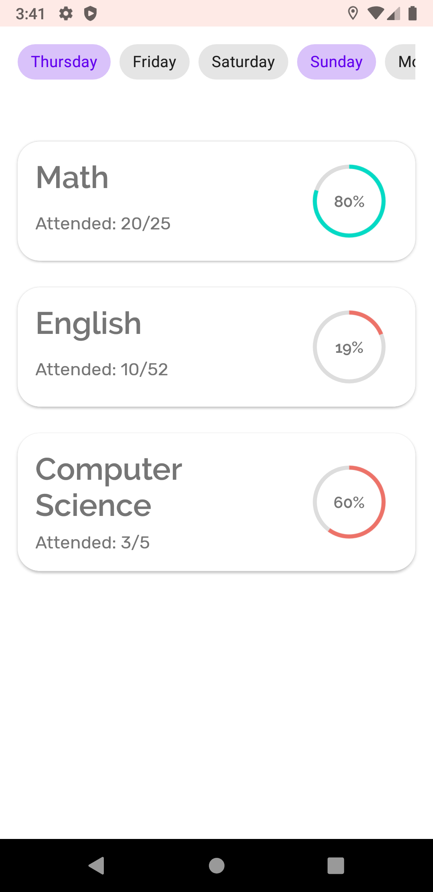
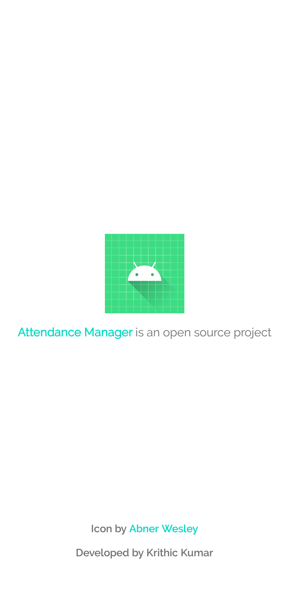
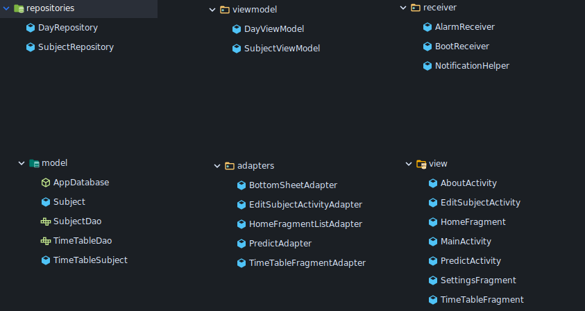

<h2 align="center"><b>Attendance Manager</b></h2>
<h4 align="center">An Android app to manage your college attendance.</h4>

<p align="center">
<a alt="License" href="LICENSE"></a>
<a alt="Codacy badge" href="https://app.codacy.com/gh/notjedi/Attendance-Manager?utm_source=github.com&utm_medium=referral&utm_content=notjedi/Attendance-Manager&utm_campaign=Badge_Grade"></a>
<a alt="Issues" href="https://github.com/notjedi/Attendance-Manager/issues"></a>
<a alt="Release version" href="https://github.com/notjedi/Attendance-Manager/releases"></a>
</p>
<hr>
<p align="center"><a href="#features">Features</a> &bull; <a href="#screenshots">Screenshots</a> &bull; <a href="#roadmap">Roadmap</a> &bull; <a href="#developer-insight">Developer Insight</a> &bull; <a href="#project-structure">Project Structure</a> &bull; <a href="#external-libraries-used">Libraries used</a> &bull; <a href="#credits">Credits</a></p>
<p align="center"><a href="#changelog">Changelog</a> &bull; <a href="#contributions">Contribution</a> &bull; <a href="#similar-apps-to-checkout">Similar apps</a> &bull; <a href="#license">License</a></p>
<hr>

 Attendance Manager is radically simple and material designed attendance managing app. This app aims
 at improving students attendance percentage by logging their attendance data. Students who bunk
 classes or absent themselves frequently would be most benefited by this app. An attendance managing
 app is ubiquitous but this app is designed to be elegant and more user-friendly with a better UI.

## Features
- Clean UI
- Predict attendance
- Backup and Restore support
- Daily notifications to mark attendance
- Time Table view to edit you time table

## Screenshots
<p align="center">




</p>
<p align="center">




</p>

## Roadmap
- [ ] Migrate to ViewPager2
- [ ] Dark Theme
- [ ] Timeline support
- [ ] Implement [themes](themes/)
- [ ] Migrate to Kotlin

## Developer Insight
- Clean Architecture
- Uses Android Jetpack components
- MVVM architecture

## Project Structure


## External Libraries used
- [ExpandableBottomBar](https://github.com/st235/ExpandableBottomBar)
- [Room](https://developer.android.com/topic/libraries/architecture/room)
- [LiveData](https://developer.android.com/topic/libraries/architecture/livedata)
- [Material Design](https://material.io) library
- [GSON](https://github.com/google/gson)

## Credits
- [Zhuinden](https://github.com/Zhuinden) for helping me out on various stuff while developing the app.
- [/r/AndroidDev](https://discord.gg/ZDarQnp) discord server.

## CHANGELOG
See [CHANGELOG.md](CHANGELOG.md)

## CONTRIBUTIONS
See [CONTRIBUTIONS.md](CONTRIBUTIONS.md)

## Similar apps to checkout
- [Kodalog](https://play.google.com/store/apps/details?id=com.devsebastian.attendancemanager)

## LICENSE

<p align="center">
<a href="http://www.gnu.org/licenses/gpl-3.0.en.html"></a>
</p>

```
Copyright 2020 Krithic Kumar

This program is free software: you can redistribute it and/or modify
it under the terms of the GNU General Public License as published by
the Free Software Foundation, either version 3 of the License, or
(at your option) any later version.

This program is distributed in the hope that it will be useful,
but WITHOUT ANY WARRANTY; without even the implied warranty of
MERCHANTABILITY or FITNESS FOR A PARTICULAR PURPOSE.  See the
GNU General Public License for more details.

You should have received a copy of the GNU General Public License
along with this program.  If not, see <http://www.gnu.org/licenses/>.
```
